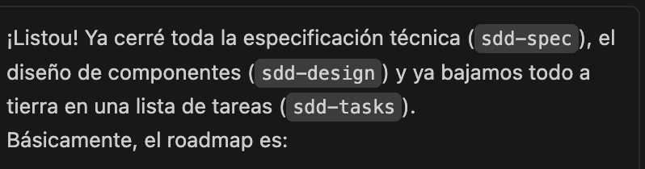

# SDD Specification: frontend-overhaul

## Component Architecture
We will implement an Atomic Design structure focused strictly on `src/components/ui`.

### Technical Stack Guidelines
1. **Next.js**: Keep existing Setup (App Router).
2. **Tailwind CSS**: Core styling engine.
3. **Framer Motion**: Required for animations. All animated UI components must declare `"use client"`.
4. **Tailwind Merge / CLSX**: We require a `cn` utility function in `src/lib/utils.ts` to cleanly merge Tailwind classes passed as props into the base components.

### 1. The `cn` Utility
```ts
// src/lib/utils.ts
import { clsx, type ClassValue } from "clsx"
import { twMerge } from "tailwind-merge"

export function cn(...inputs: ClassValue[]) {
  return twMerge(clsx(inputs))
}
```

### 2. Core Components API
All base components will accept standard HTML props plus custom styling modifiers.

1. **Button**:
   - `variant`: `primary` (sky gradient), `secondary` (white with border), `danger`.
   - `size`: `sm`, `md`, `lg`.
2. **Card**:
   - `hoverable`: boolean (adds `-translate-y-0.5 shadow-md` on hover).
3. **Badge**:
   - `status`: maps directly to `emerald`, `sky`, `slate`, `violet`, `red`.

### 3. Route Restructuring
- Rename `src/app/page.tsx` to `src/app/login/page.tsx`.
- Create a NEW `src/app/page.tsx` representing the Landing Page.
- The `layout.tsx` for the main app remains the global provider wrapper, but `app/dashboard/layout.tsx` needs an `AnimatePresence` wrapper if we want page-level transitions.

## Data Fetching & State
No changes to global state management (AuthContext remains). The UI overhaul is purely presentational.
